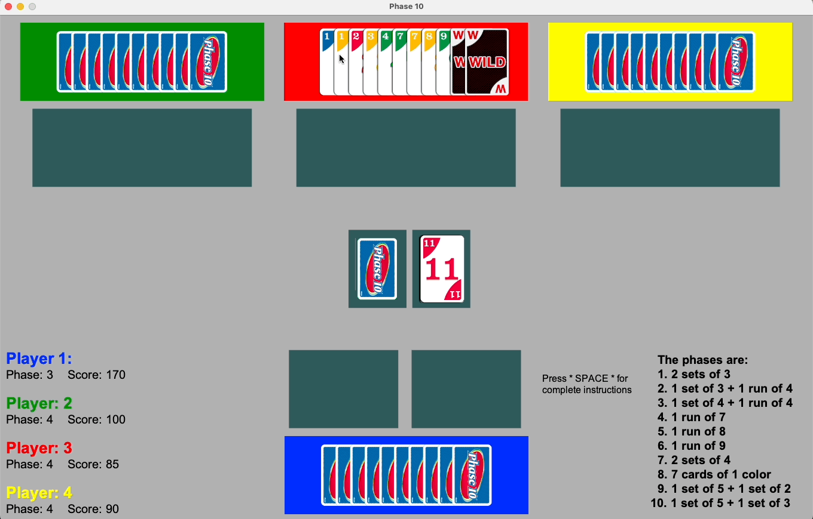

<h1 align="center">
  <br>
  
  <br>
  Phase 10
  <br>
</h1>

<h4 align="center">A 2D rummy-type card game with a challenging twist.</h4>

<p align="center">
    
</p>


## Table of Contents

* [About The Game](#about-the-game)
* [Requirements](#requirements)
  * [Python Version](#python-version)
  * [Arcade Version](#arcade-version)
* [Installation](#installation)
* [How To Play](#how-to-play)
  * [Object](#object)
  * [Play](#play)
  * [Definitions](#definitions)
    * [Sets](#sets)
    * [Runs](#runs)
    * [Wild cards](#wild-cards)
    * [Skip cards](#skip-cards)
    * [Making a Phase](#making-a-phase)
    * [Hitting](#hitting)
    * [Finishing a round](#finishing-a-round)
    * [Scoring](#scoring)
* [Future Improvements](#future-improvements)

# About The Game
The game is named after the ten phases (or melds) a player must advance through to win. Built using the Python Arcade library, Phase 10 is a four player, all user-controlled, game.

# Requirements

All requirements are listed in the `requirements.txt` file.

### Python Version
Python 3.11.9

### Arcade Version
arcade 2.6.17

# Installation

To clone and run the game, create a new folder, then set up and activate a virtual environment.
```shell
# Example of setting up a virtual environment
$ python3 -m venv venv
$ source venv/bin/activate
```

Next, clone the repository and install the dependecies using the following commands:
```shell
# Clone this repository
$ git clone https://github.com/jake-bestland/Phase_10.git

# Go into the repository
$ cd Phase_10

# Install dependencies
$ pip install -r requirements.txt
```

To run the game, enter the following command into your teminal:
```shell
$ python phase_10.py
```


# How To Play
## OBJECT:

To be the first player to complete all 10 Phases. In case of a tie, the player with the lowest score is the winner.

## PLAY:

On your turn, draw one card, either from the top card from the draw pile or the top card from the discard pile.
End your turn by discarding any one of your cards onto the top of the discard pile.  During the play of the firsthand,
each player tries to complete Phase 1.  A Phase is a combination of cards.  Phases are made of sets, runs, cards of
one color, or a combination of sets and runs.
These are the 10 phases:
1. 2 sets of 3
2. 1 set of 3 + 1 run of 4
3. 1 set of 4 + 1 run of 4
4. 1 run of 7
5. 1 run of 8
6. 1 run of 9
7. 2 sets of 4
8. 7 cards of one color
9. 1 set of 5 + 1 set of 2
10. 1 set of 5 + 1 set of 3

Each player can make only one Phase during each hand.  Phases must be completed in order, from 1 to 10.

## DEFINITIONS:

### <ins>Sets:</ins>
A set is made of two or more cards with the same number.

### <ins>Runs:</ins>
A run is made of four or more cards numbered in order

<details>
    <summary>Example of a run and set.</summary>
    <br>
    <p>
        
    </p>
    <p>
      
    </p>
    <br>
</details>
<br>

### <ins>Wild cards:</ins>
<p>
  
</p>
a "Wild" card may be used in place of a number card, or may be used as any color, in order to complete a Phase

### <ins>Skip cards:</ins>
<p>
  
</p>
When played it will cause another player to lose a turn.  To use, drop the "Skip" card onto another players "hand"

<details>
  <summary>Playing a skip card preview</summary>
  <br>

  <p>
    
  </p>

  > Skipping Player 3 (red)
</details>
<br>

### <ins>Making a Phase:</ins>
If during your turn, you are able to make a Phase with the cards in your hand, lay the Phase down in the empty space(s) near your hand before discarding.
- You must have the whole Phase in hand before laying it down.
- You may lay down more than the minimun requirements of a Phase, but only if the additional cards can be directly added to the cards already in the Phase pile.

<details>
  <summary>
    Preview of making a valid and invalid phase.
  </summary>
<br>

- Player completing phase 4 (run of 7)
<p>
  
</p>

> Player uses wild cards to complete the run, and is able to lay down more than the minimun requirement.
>> after discarding, the wild cards will be sorted into the correct position of the completed phase.
<br>

- An incomplete or invalid phase will return cards back into the player's hand.

<p>
  
</p>

> Invalid phase (above)
<br>


<p>
  
</p>

> Incomplete phase (above)
<br>

</details>
<br>

### <ins>Hitting:</ins>
Hitting is the way to get rid of leftover cards after making a phase.  You may hit by putting a card directly on a Phase already laid down.
The card must properly fit with the cards already laid down.  Before you can make a hit, your own Phase must already be laid down. You may hit on your own cards,
another player's cards, or both.

<details>
  <summary>
    Hitting Example
  </summary>
<br>
  
<p>
  
</p>

> Current player has completed their own phase, so they may play cards on another players' phase.
</details>
<br>

### <ins>Finishing a round:</ins>
The first player to get rid of all the cards in their hand, wins the round.  The winner of the round and any other players who also complete their Phase, will
advance to the next Phase.

<details>
  <summary>End of round preview</summary>
  <br>
  
  <p>
    
  </p>

  > You can end a round by successfully placing your last card on a phase pile, or by discarding it (as shown here).
  >> Scores and phases are automatically updated on the scoreboard and the next round begins.
  <br>
</details>
<br>

### <ins>Scoring:</ins>
The winner of the round scores zero.  All remaining players score points against them, for cards still in their hand, as follows:
- 5 points for each card numbered 1-9
- 10 points for each card numbered 10-12
- 15 points for each "Skip" card
- 25 points for each "Wild" card

# Future Improvements
* The game could eventually include a computer AI to play for the three other "computer" players.
Currently, the game is user-controlled for all four players.
* Add a round 'recap' to illustrate which player(s) moved to next round and their scores.
* Add a feature to save the game to be continued later.
  - write/read file in the `phase_10.py` file on lines 163-166 (where players are created).
